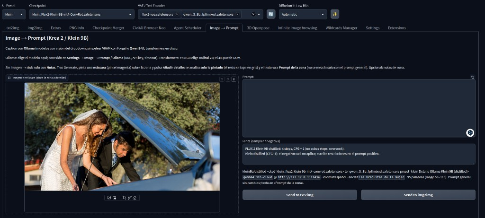
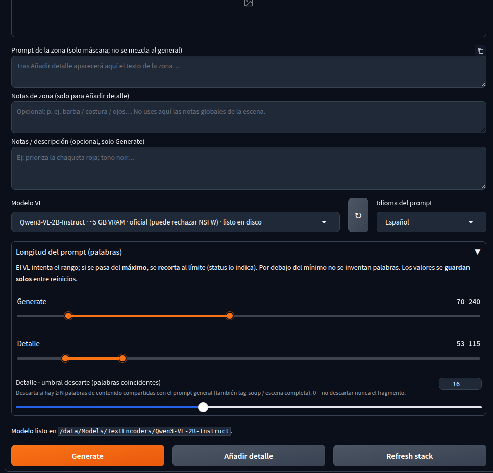
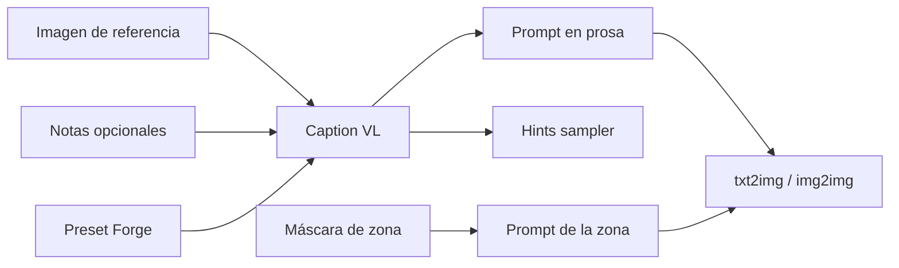
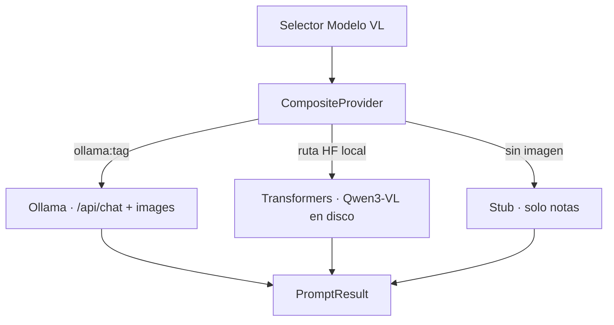
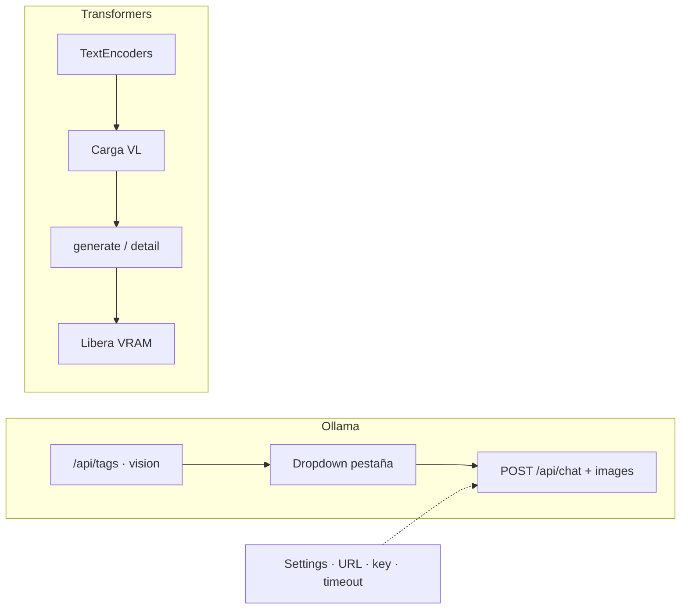

# Image → Prompt

**De una imagen de referencia a un prompt listo para generar** — integrado en [Forge Neo](https://github.com/Haoming02/sd-webui-forge-classic/tree/neo).

Una pestaña dedicada que lee tu **UI Preset** (checkpoint + text encoder), produce **prosa** alineada con el stack activo y te permite **refinar zonas** con máscara. Pensado para flujos profesionales de iteración visual: referencia → prompt → txt2img / img2img.

<p align="center">
  
</p>

<p align="center"><em>Espacio de trabajo: referencia a la izquierda, prompt e hints a la derecha, envío directo a generación.</em></p>

---

## Por qué existe

Reproducir o reinterpretar una imagen no debería empezar desde cero en un cuadro de texto. Tampoco debería obligarte a pelear VRAM entre el checkpoint de difusión y el modelo de visión.

**Image → Prompt** resuelve ambos problemas:

| Problema | Enfoque |
|----------|---------|
| Prompts genéricos o en estilo booru | Caption en **prosa**, calibrada al stack detectado |
| Settings de sampler a ciegas | **Hints** según Krea 2 (Turbo / RAW) o FLUX.2 Klein 9B (distilled / base) |
| Detalle local perdido en el caption global | **Máscara** → análisis de zona → campo aparte |
| VRAM disputada | Backend **Ollama** fuera del proceso Forge (recomendado) |

---

## Flujo de trabajo

1. Carga un preset **Krea 2** o **Klein 9B** en Forge Neo.
2. Abre la pestaña **Image → Prompt**.
3. Sube o pega la imagen de referencia.
4. (Opcional) Añade notas de dirección creativa.
5. **Generate** — prompt en prosa + hints de sampler.
6. (Opcional) Pinta una zona y **Añadir detalle** — texto solo en *Prompt de la zona*.
7. **Send to txt2img** o **img2img**.

<p align="center">
  
</p>

<p align="center"><em>Control fino: modelo VL, idioma, longitud de Generate / Detalle y umbral anti-redundancia.</em></p>



---

## Proveedores de visión

La extensión no acopla el caption al text encoder del stack de generación. Usa un **modelo de visión** aparte, elegible en el dropdown, con tres caminos:



### Ollama — recomendado en producción local

- El VL corre **fuera** del proceso de Forge: el checkpoint conserva la VRAM.
- Lista viva de modelos con capability `vision` (local y cloud) vía `GET /api/tags`.
- Conexión en **Settings → Image → Prompt / Ollama** (URL, API key, timeout).
- El **modelo se elige en la pestaña**; botón ↻ para refrescar el catálogo.

Ideal cuando Forge y Ollama coexisten (incluido Docker en el host con gateway `172.17.0.1`).

### Transformers — en proceso Forge

- Modelos Qwen3-VL Instruct descargados a `TextEncoders/<nombre>/`.
- Útil sin servicio Ollama; en GPUs de 8 GB conviene el perfil de menor VRAM (~5 GB).
- Durante el caption se libera memoria del checkpoint para abrir hueco al VL.

### Stub — sin imagen

- Si solo hay notas de texto, genera un punto de partida sin llamar al VL.



---

## Detalle por máscara

El caption global describe la escena. Cuando necesitas precisión en un elemento concreto:

1. Tras **Generate**, pinta con el pincel sobre la zona.
2. **Añadir detalle** analiza **solo lo pintado** (el resto se atenúa).
3. El resultado va a **Prompt de la zona** — no se mezcla automáticamente al prompt general.
4. Umbral de descarte: si el fragmento es demasiado redundante respecto al prompt base, se descarta.

Diseñado para iterar ropa, manos, objetos o focos sin reescribir toda la escena.

---

## Stacks soportados

| Stack | Detección | Hints típicos |
|-------|-----------|----------------|
| **Krea 2** Turbo / RAW | Checkpoint + TE Qwen3-VL | Pasos / CFG según variante |
| **FLUX.2 Klein 9B** distilled / base | Checkpoint + TE Qwen3 8B | Distilled: pocos pasos, CFG=1 |

Otros presets reciben aviso de compatibilidad; el caption puede ejecutarse igualmente según el VL elegido.

---

## Instalación

Compatible con `--skip-install` (sin `install.py`).

### Desde la WebUI

1. **Extensions** → **Install from URL**
2. Repositorio:

```text
https://github.com/pcgarat/sd-forge-img2prompt
```

3. **Install** → **Apply and restart UI**

### Por terminal

```bash
git clone https://github.com/pcgarat/sd-forge-img2prompt.git \
  "$EXTENSIONS_PATH/sd-forge-img2prompt"
```

Reinicia Forge Neo.

### Ollama + Docker

Si Forge corre en contenedor y Ollama en el host:

1. Expón Ollama fuera de localhost (`OLLAMA_HOST=0.0.0.0:11434`).
2. En Settings de la extensión: `http://172.17.0.1:11434` (o la gateway de tu red).
3. Opcional: API key / `ollama signin` para modelos cloud.

---

## Documentación

| Recurso | Descripción |
|---------|-------------|
| [Forge Neo](https://github.com/Haoming02/sd-webui-forge-classic/tree/neo) | Runtime objetivo (rama `neo`) |
| [Documentación extendida](docs/guia_desarrollador_img2prompt_26-09-2026.md) | Arquitectura, flujos, contratos UI ↔ providers |
| [Spec producto](docs/spec-forge-neo-img2prompt_25-09-2026.md) | Alcance y criterios de aceptación |
| [Spec backend Ollama](docs/spec-ollama-backend_26-09-2026.md) | API nativa `/api/chat` + visión |

---

## Desarrollo

```bash
git clone https://github.com/pcgarat/sd-forge-img2prompt.git
cd sd-forge-img2prompt
python -m pytest tests -q
```

Con **docker-neo**: monta el repo con `IMG2PROMPT_EXT_PATH` y reinicia el stack. Evita symlinks desde `EXTENSIONS_PATH` hacia rutas fuera del volumen del contenedor.

---

## Licencia

MIT © colaboradores del proyecto.
