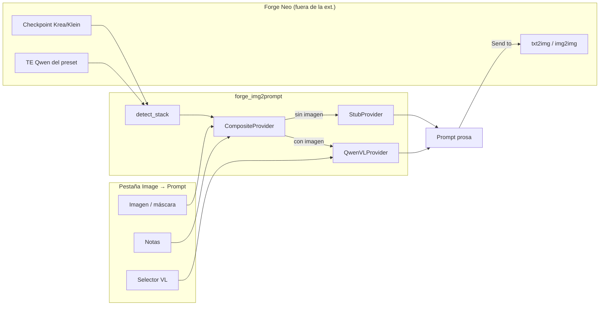
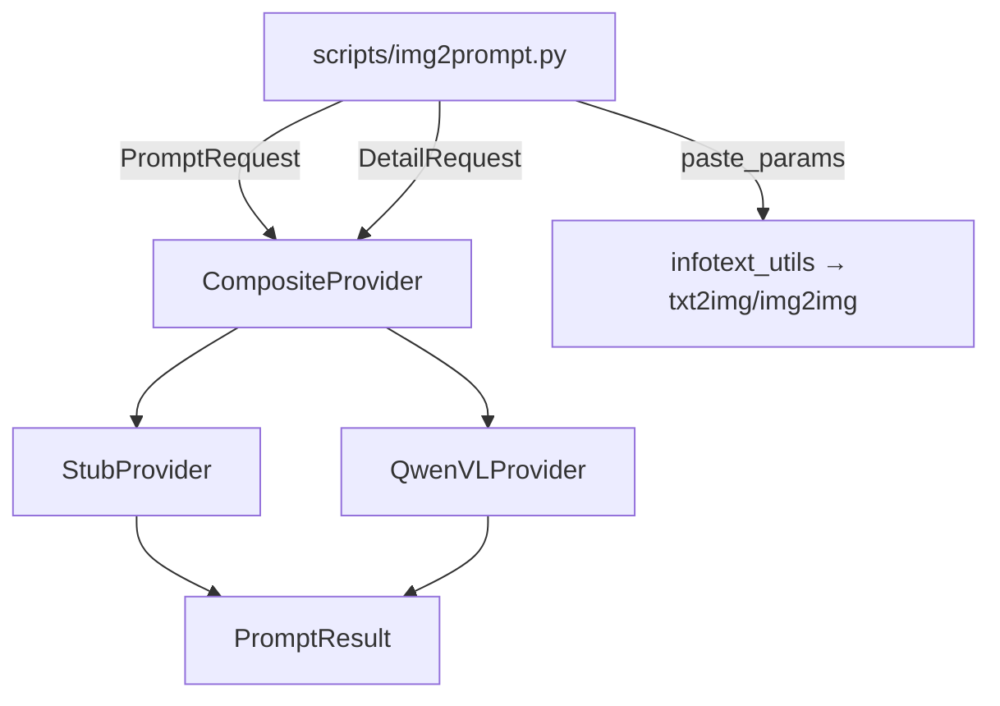
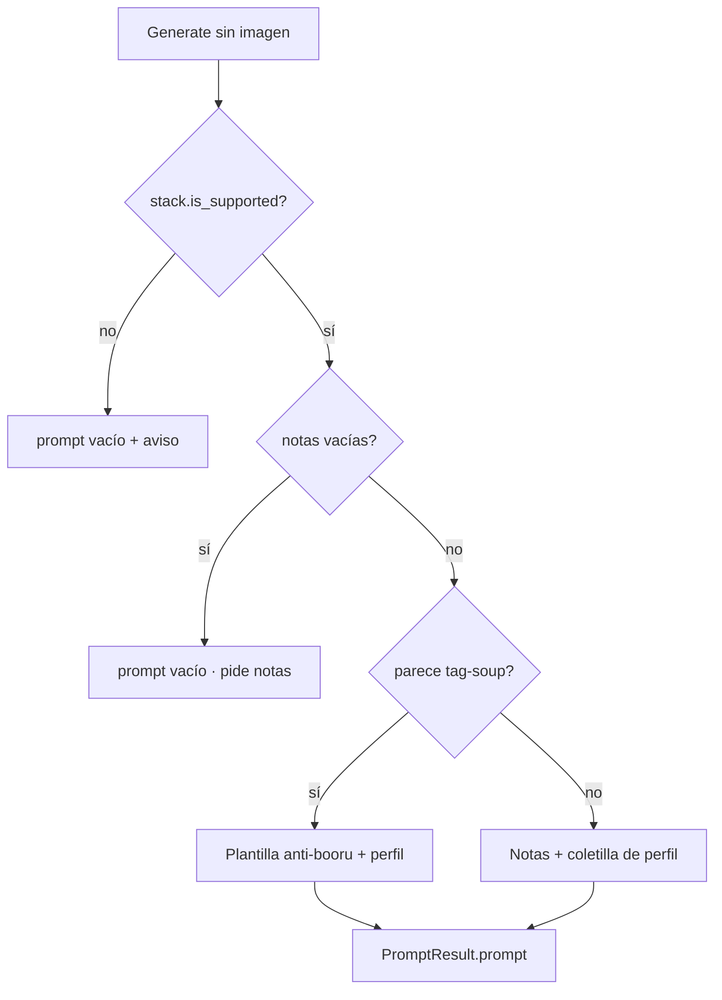
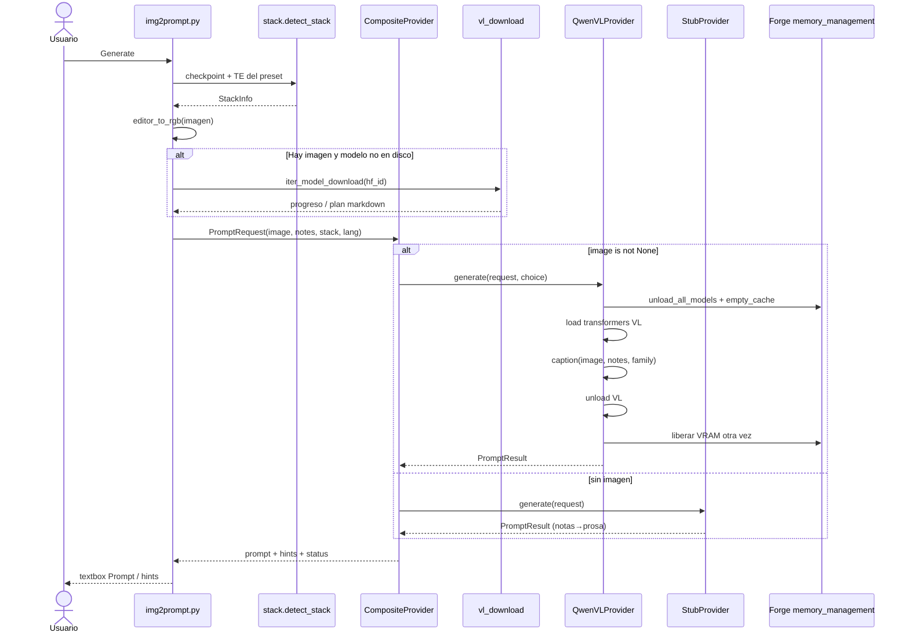
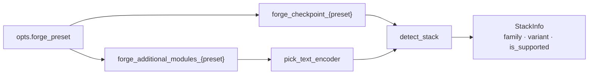
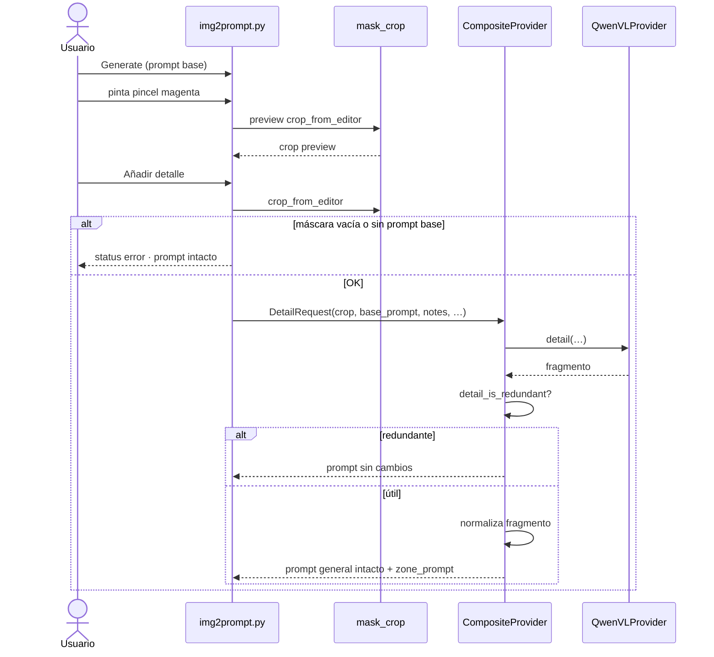
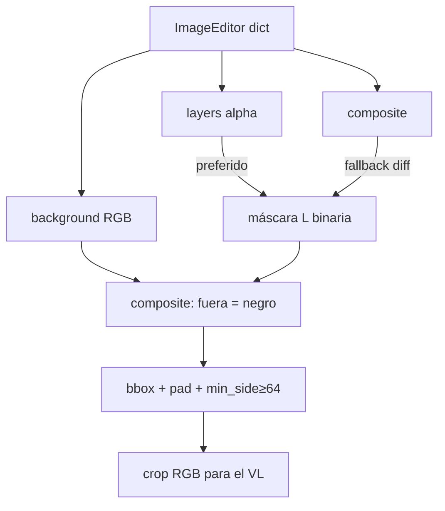
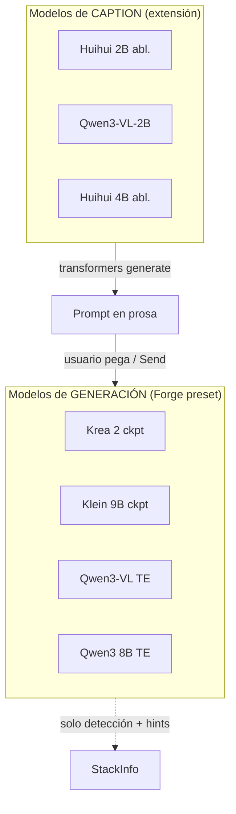

# Última modificación: 2026-09-26

# Guía de desarrollador — sd-forge-img2prompt

Cómo encajan la UI Gradio, las **notas**, la detección de stack Forge y los modelos VL. Pensada para quien toca código o diseña cambios de flujo.

---

## 1. Mapa mental en 30 segundos

Hay **dos familias de modelos** que no hay que confundir:

| Rol | Qué es | Dónde vive |
|-----|--------|------------|
| **Stack Forge** (generación) | Checkpoint Krea 2 / Klein 9B + text encoder Qwen | Preset activo de Forge Neo (`forge_checkpoint_*`, módulos TE) |
| **Modelo VL** (caption) | Qwen3-VL Instruct (oficial o Huihui abliterated) | `TextEncoders/<nombre>/`, cargado solo durante Generate / Añadir detalle |

La extensión **no** usa el TE del stack para captionar. El TE Qwen3-VL del preset Krea es el encoder de *generación*; el VL de la pestaña es un modelo aparte (transformers) que se descarga, carga, captiona y se descarga de VRAM.



---

## 2. Arquitectura de módulos

```text
scripts/img2prompt.py          # on_ui_tabs, wiring Gradio, send-to
forge_img2prompt/
  stack.py                     # family/variant desde nombres ckpt+TE
  provider.py                  # PromptRequest/Result, Stub, append_detail, notas→prosa
  vl_catalog.py                # catálogo HF + rutas TextEncoders
  vl_download.py               # descarga 1ª vez
  vl_provider.py               # QwenVLProvider + CompositeProvider
  mask_crop.py                 # ImageEditor brush → crop enmascarado
  log.py                       # [img2prompt] en terminal Forge
```

**Contrato UI → lógica:** la pestaña no construye prompts. Solo arma `PromptRequest` / `DetailRequest` y muestra `PromptResult`.



Patrón: **Strategy** (`PromptProvider`) + **Composite** (elige stub vs VL) + **DTO inmutables** (`PromptRequest`, `DetailRequest`, `StackInfo`).

---

## 3. Cómo funcionan las notas

Campo UI: **Notas / descripción (opcional)** → `user_notes` en ambos requests.

Las notas **no** son el prompt final tal cual: se interpretan según el camino (stub vs VL) y el perfil de stack.

### 3.1 Normalización común

En `provider._normalize_notes`:

1. Colapsa whitespace.
2. Quita comillas exteriores.

### 3.2 Camino stub (sin imagen)

`CompositeProvider.generate` → `StubProvider` si `image is None`.

| Caso | Comportamiento |
|------|----------------|
| Stack no soportado | Prompt vacío + status de aviso |
| Notas vacías | Prompt vacío; status pide escribir notas (v1 stub no “ve” nada) |
| Notas con prosa | `_notes_to_prose`: capitaliza, añade punto, **envuelve** con instrucción de perfil Krea/Klein |
| Notas tipo tag-soup (≥6 comas o hints booru) | Reescribe como “escena detallada: …” + anti-keyword list |

El texto de envoltorio depende de `language` (`es` / `en`) y `family` (`krea2` vs `klein9b`). Klein insiste en relaciones espaciales; Krea en composición/luz/materiales. Ambos piden texto legible en la imagen entre comillas.



### 3.3 Camino VL (con imagen)

Las notas **no** sustituyen al caption: van al **user prompt** del chat VL:

> `User notes to respect or weave in: {notes}`

El system prompt fuerza un párrafo de prosa visual (sujeto → pose → entorno → composición → luz → materiales). Si el modelo es *abliterated*, se añade instrucción uncensor.

En **Añadir detalle**, el mismo textbox de notas se reutiliza como:

> `User notes about this zone only: {notes}`

**Importante:** el prompt global **no** se pega al VL de detalle (evita que el modelo lo parafrasee). Solo crop + notas de zona + system de “label de máscara”.

### 3.4 Crítica / mejoras posibles

1. **Un solo textbox para Generate y Detalle.** Si dejas notas globales (“tono noir”) y luego añades detalle de una zona, esas mismas notas se envían al crop. Conviene un campo **Notas de zona** separado, o limpiar/ignorar notas globales en `detail()`.
2. **Sliders de longitud en UI no están cableados** a `PromptRequest.word_min/max` / `DetailRequest` (el provider ya los soporta; la UI usa defaults). Cablear o quitar los sliders hasta que lo estén.
3. En stub, las notas se **amplifican** con coletilla fija; en VL se **tejen**. El usuario puede no percibir la diferencia: documentarlo en la UI ayuda.

---

## 4. Flujo completo: Generate



### Lectura del stack (no es el modelo VL)



Heurísticas (`stack.py`):

| Family | Checkpoint (tokens) | TE esperado | Variants |
|--------|---------------------|-------------|----------|
| `krea2` | `krea2`, `krea-2`, … | Qwen3-VL | `turbo` / `raw` / `unknown` |
| `klein9b` | `klein`, `flux2-klein`, … | Qwen3 8B | `base` / `distilled` |
| otro | — | — | `unknown`, `is_supported=False` |

Si el stack no es soportado, **ni stub ni VL** inventan un prompt “optimizado”.

---

## 5. Flujo: máscara → Añadir detalle



### Pipeline de máscara



`append_detail("", fragment)` solo normaliza el texto de zona (espacios, mayúscula, punto). El prompt general **no** se modifica; el fragmento va a «Prompt de la zona».

---

## 6. Modelos que intervienen

### 6.1 Modelos de generación (Forge — contexto, no caption)

Usados **después** (Send to txt2img) o para **hints**; la extensión solo los *lee* por nombre:

| Stack | Checkpoint típico | Text encoder | Hints sampler |
|-------|-------------------|--------------|---------------|
| Krea 2 Turbo | `*turbo*` | Qwen3-VL | ~8 steps, CFG 0–1 |
| Krea 2 RAW | `*raw*` | Qwen3-VL | ~28 steps, CFG ~4.5 |
| Klein 9B distilled | klein sin `base` | Qwen3 8B | 4 steps, CFG=1 |
| Klein 9B base | `*base*` | Qwen3 8B | 20–50 steps, CFG 3.5–5 |

Durante el caption VL se llama a `backend.memory_management.unload_all_models` para liberar el checkpoint y caber el VL en VRAM (p. ej. 8 GB).

### 6.2 Modelos VL (caption — catálogo)

Definidos en `vl_catalog.VL_SPECS`:

| Selector UI | Hugging Face | VRAM aprox. | Notas |
|-------------|--------------|-------------|--------|
| ★ Huihui 2B abliterated | `huihui-ai/Huihui-Qwen3-VL-2B-Instruct-abliterated` | ~5 GB | Default recomendado; uncensor |
| Qwen3-VL-2B-Instruct | `Qwen/Qwen3-VL-2B-Instruct` | ~5 GB | Oficial; puede rechazar NSFW |
| Huihui 4B abliterated | `huihui-ai/Huihui-Qwen3-VL-4B-Instruct-abliterated` | ≥9 GB | Mejor calidad; `risk=oom_8gb` |

- Descarga: `TextEncoders/<local_name>/` (`config.json` + `*.safetensors`).
- Runtime: `transformers.AutoModelForImageTextToText` + `AutoProcessor`, BF16 en CUDA / FP32 en CPU.
- Tras cada generate/detail: `unload()` + liberar VRAM Forge otra vez.



---

## 7. Decisiones de diseño (y dónde empujar)

| Decisión | Motivo | Riesgo / alternativa |
|-----------|--------|----------------------|
| Pestaña `on_ui_tabs` vs AlwaysVisible | Tool pesada en VRAM; send-to idiomático Neo | AlwaysVisible si priorizas cero cambio de tab |
| Composite stub/VL | Sin imagen aún hay flujo usable | Podría unificar mensajes UI “modo stub” más visibles |
| Append de detalle, no rewrite | Conserva caption global | Feature futura: rewrite / imagen atenuada |
| Liberar Forge antes del VL | 8 GB no caben ckpt + VL | Flicker de modelo; documentar “vuelve a cargar al generar” |
| Heurística de nombres para stack | Sin API estable de “familia” | Falsos negativos si renombran archivos |

**Patrones útiles si crece el código:**

- **Strategy** ya está (`PromptProvider`); un provider GGUF/llama.cpp sería otra implementación.
- **Adapter** para el valor Gradio del `ImageEditor` (ya encapsulado en `mask_crop`).
- **Null Object** / status codes tipados en lugar de strings largos en `PromptResult.status` si la UI se complica.

---

## 8. Puntos de extensión

1. **Nuevo backend de visión:** implementar `generate` (+ opcional `detail`) compatible con `PromptResult`; enchufar en `CompositeProvider` o sustituir `_PROVIDER` en el script.
2. **Nueva familia de stack:** ampliar tokens en `stack.py` + `_sampler_hints` / `_negative_hint` / coletillas de `_notes_to_prose` y `_family_hint`.
3. **Nuevo VL en catálogo:** fila en `VL_SPECS` (mismo layout HF Instruct).
4. **Tests sin Forge:** `pytest tests -q` — stack, stub, mask_crop, append_detail, catálogo, idioma VL.

---

## 9. Checklist mental al tocar el flujo

- [ ] ¿Las notas se interpretan en stub, VL caption y VL detail de forma coherente?
- [ ] ¿El stack se lee del **preset** (`forge_checkpoint_*`), no solo de `sd_model_checkpoint`?
- [ ] ¿Tras VL se descarga el modelo y se libera VRAM?
- [ ] ¿El detalle llena solo «Prompt de la zona» y no pisa el prompt general si falla o es redundante?
- [ ] ¿Send-to usa `modules.infotext_utils`, no APIs deprecadas?

---

## Referencias en el repo

| Doc / código | Contenido |
|--------------|-----------|
| `docs/spec-forge-neo-img2prompt_25-09-2026.md` | Spec v1 + decisiones de extensión Neo |
| `docs/guia_img_prompts_23-09-2026.md` | Principios de prosa Krea / FLUX |
| `README.md` | Uso e instalación |
| `tasks/todo.md` | Estado de features |
| `forge_img2prompt/provider.py` | Notas → prosa (stub) + fusión detalle |
| `forge_img2prompt/vl_provider.py` | Prompts system/user del VL |
| `scripts/img2prompt.py` | Wiring Gradio end-to-end |
